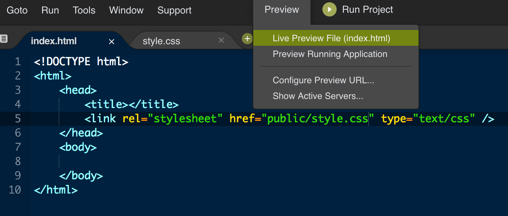

# Build a Profile Page

## The Goal

More and more these days, developers rely on digital resumes. They build a website that not only tells what they can do, it also demonstrates their capacity to actually do those things.

Since you aren't vying for a job, you should feel free to fill your profile page with whatever information you want. Here are some suggestions:

* Your name
* A photo (of you, or that represents you)
* Your interests
* A list of your top ten favorite movies / books / games.
* Pictures of your pet or pets
* Links to your favorite websites
* A form where some of your fans can contact you
* A table with a ranking of all your favorite foods / celebrities / anything, really

## Test It!

When you're ready to test your webpage in cloud 9, you can click on the preview button up top to get a live preview of the page.



## Elements To Try

###### These elements are listed in order of increasing complexity. Scroll down for tips.

* h1 - h6 elements
* Paragraphs (p-tags)
* Images
* Links (a-tags)
* Ordered lists
* Unordered lists
* Sections, divs
* Tables
* Forms, including input types like...
    * text
    * password
    * number
    * date
    * radio
    * checkbox
    * button
    * submit

As you move down the list, these items will get more complicated, and involve multiple, nested elements. Try looking at the <a href="https://www.w3schools.com/html/">w3schools guides</a>, and use their "try it yourself" buttons to see how a given block of HTML might look on a webpage.

## Implementing CSS

You may find yourself wanting to do some basic styling, like aligning text, changing background colors, or changing text colors. All of that is done most efficiently through CSS (cascading stylesheets). CSS lets you style things in groups, rather than one at a time.

Before you can do that, you need to connect (or link) your index.html page to the style.css stylesheet. Looking at the file structure, we can see that the stylesheet is in a directory called public, so the address or route we will use to link the two files (the index and the stylesheet) will be `public/style.css`.

Here's the code you'll want to put in between the `<head>` tags:

```html
<link rel="stylesheet" href="public/style.css" type="text/css" />
```

You'll notice that there's no closing `</link>` tag - tags like this function more as objects than as containers. An attribute meant to connect (or link) two documents won't have anything inside of it.

The `rel` and `type` attributes make it clear to the browser what it can expect to find there (a stylesheet, written in text, meant to be interpreted as css).

Once you've done that, you'll want some way to make sure the linked documents work. Put this code in your style.css document, and if the link was successful, then the background will be blue in your live preview file.

```css
body {
    background-color: blue;
}
```
